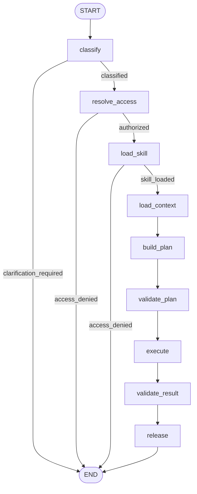

# EnterpriseOps Analytics — Implementation Walkthrough

This document describes the current EnterpriseOps implementation. It replaces
the chronological phase journal as the authoritative implementation guide.

All identities, data, metrics, business units, and scenarios are synthetic.

## 1. Purpose and implemented scope

EnterpriseOps is a governed analytics assistant for bounded finance and
operations questions. It demonstrates how model reasoning can be combined with
skills, MCP tools, semantic definitions, user-scoped authorization,
deterministic query policy, independent result validation, and safe release.

Supported question classes are:

1. Finance variance
2. Business-unit contribution
3. Operations driver

Unsupported or underspecified questions clarify rather than guessing.
Unauthorized questions stop before complete skill instructions or analytics
execution are exposed.

Core design rule:

> The model may classify, propose a typed plan, and explain validated results.
> Deterministic code controls eligibility, authorization, scope, execution,
> arithmetic, and release.

## 2. Current architecture



The topology is intentionally bounded. There is no open-ended tool loop. Early
conditional edges stop unsupported or unauthorized requests before query
execution. After authorization, the graph follows a fixed governed trajectory.

## 3. Graph-node map

| Node | Responsibility | Important state effect or boundary |
|---|---|---|
| `classify` | Extract supported question class, period, region, and category | Sets normalized intent or `clarification_required` |
| `resolve_access` | Call `list_available_domains` and enforce domain eligibility | Sets authorized status or `access_denied` |
| `load_skill` | Select from eligible metadata and load only the chosen skill | Sets skill name, version, and instructions |
| `load_context` | Retrieve dataset schema and governed metric definitions through MCP | Populates planning context |
| `build_plan` | Produce a typed plan bound to classified scope | Sets `query_plan`; performs no data execution |
| `validate_plan` | Call `validate_query` and obtain a plan-bound receipt | Sets the validation identifier required for execution |
| `execute` | Call `execute_analytics_query` using the receipt | Sets `analytics_result` |
| `validate_result` | Call `validate_result` against the independent deterministic contract | Sets `result_valid` and errors |
| `release` | Generate narration and validate numeric claims | Sets `final_answer` only when all checks pass |

The live topology is defined in
`use_cases/enterprise_analytics/live_graph.py`. The deterministic graph in
`graph.py` exercises the same control pattern without live model calls.

## 4. Skills and progressive disclosure

A skill is a versioned package of domain metadata and instructions, not an
imported Python library.

Progressive disclosure works in this order:

1. The registry exposes small metadata records.
2. Authorization filters out ineligible domains.
3. Routing selects from the eligible skills.
4. Only the selected skill's full `SKILL.md` is loaded.
5. Skill identity and version are recorded in workflow state and traces.

The current skills are:

```text
use_cases/enterprise_analytics/skills/
├── finance_variance/SKILL.md
└── operations_performance/SKILL.md
```

Skills provide domain reasoning instructions. MCP provides executable
capabilities. Authorization remains a separate deterministic boundary.

## 5. MCP tool surface

| Tool | Purpose |
|---|---|
| `list_available_domains` | Return domains authorized for the synthetic user |
| `get_metric_definition` | Return governed metric meaning and formula |
| `get_dataset_schema` | Return permitted fields, types, and relationships |
| `validate_query` | Apply query and access policy and issue a validation receipt |
| `execute_analytics_query` | Execute the already-approved plan |
| `validate_result` | Compare observed output with the independent contract |

The graph may call tools; the model does not receive unrestricted SQL or a
generic database execution interface.

## 6. Semantic and data contracts

Runtime fixtures and contracts are packaged with the use case:

```text
use_cases/enterprise_analytics/data/
├── business_units.csv
├── finance_actuals.csv
├── finance_budget.csv
├── operations_metrics.csv
├── semantic_definitions.json
└── golden_cases.json
```

`semantic_definitions.json` defines metric IDs, domains, formulas, and allowed
dimensions. This separates governed business meaning from prompts.

`golden_cases.json` is part of the runtime validation contract and therefore
lives with the use case—not under `evals/`. The same versioned contract supports
deterministic result validation and evaluation expectations.

## 7. Authorization, query policy, and receipts

Authorization occurs before detailed policy and execution. This ordering
avoids leaking supported filters, dimensions, skill instructions, or data
behavior to an unauthorized caller.

`validate_query` checks, among other controls:

- authorized domain access;
- supported question class and required metrics;
- required and allowlisted filters;
- valid period, region, and cost-category formats;
- allowed metric/dimension combinations;
- row limits and read-only bounded behavior;
- duplicate or unexpected filters.

Successful validation issues a short-lived receipt bound to:

- user identity;
- canonical plan hash;
- semantic-catalog version;
- policy version;
- issue and expiration times.

Execution accepts the receipt identifier, not a newly supplied plan. Before
execution, the service checks ownership, expiry, and plan binding. This closes
the validate-one-plan/execute-another gap.

The in-memory receipt store is sufficient for the single-process demo. A
production implementation would use signed or durable receipts and an
auditable distributed store.

## 8. Independent result and claim validation

The runtime does not treat successful tool execution as proof of correctness.

1. The query service calculates the observed result.
2. `validate_result` independently recomputes expected values from the golden
   contract.
3. Mismatches set `result_valid=false` and prevent release.
4. After validation, the model creates a narrative.
5. Deterministic claim validation checks monetary values, percentages,
   contributions, scope, and driver claims against the validated result.
6. Unsupported narrative claims return clarification rather than an answer.

The independent oracle must not simply call the same calculator used by the
execution path; otherwise correlated defects could self-validate.

## 9. Component boundaries

| File or directory | Responsibility |
|---|---|
| `use_cases/enterprise_analytics/live_graph.py` | Live graph and Azure-reasoning adapter |
| `use_cases/enterprise_analytics/graph.py` | Deterministic graph composition |
| `use_cases/enterprise_analytics/state.py` | Typed workflow state |
| `use_cases/enterprise_analytics/schemas.py` | Intent, plan, catalog, and result models |
| `use_cases/enterprise_analytics/routing.py` | Bounded baseline routing support |
| `use_cases/enterprise_analytics/skill_registry.py` | Metadata discovery, authorization filtering, instruction loading |
| `use_cases/enterprise_analytics/semantic_catalog.py` | Governed metric catalog loader |
| `use_cases/enterprise_analytics/query_policy.py` | Deterministic plan policy |
| `use_cases/enterprise_analytics/reference_calculator.py` | Fixture-based finance and operations calculations |
| `use_cases/enterprise_analytics/golden_result_validation.py` | Independent runtime result contract |
| `use_cases/enterprise_analytics/claim_validation.py` | Numeric narrative checks |
| `use_cases/enterprise_analytics/mcp_gateway.py` | In-process MCP client boundary |
| `use_cases/enterprise_analytics/mcp_server/` | Authorization, catalog, tools, models, and query service |
| `app/api/enterprise_analytics.py` | External API and response filtering |
| `evals/enterprise_analytics/` | Datasets, evaluators, offline runner, and LangSmith experiment |
| `tests/unit/enterprise_analytics/` | EnterpriseOps deterministic unit suite |

## 10. API contract

| Method | Endpoint | Purpose |
|---|---|---|
| `GET` | `/health` | Runtime health |
| `POST` | `/v1/enterprise-analytics/queries` | Run a governed analytics request |

The API exposes governed results only for completed workflows. Clarification
and access-denied responses do not expose internal analytics results.

The request-body `user_id` is a synthetic-demo adapter. Production must derive
subject, tenant, roles, and groups from validated identity claims and
re-enforce row and object permissions in the source system.

## 11. Configuration and local setup

```bash
python3.12 -m venv .venv
source .venv/bin/activate
python -m pip install --upgrade pip
python -m pip install -r requirements.txt
```

The live graph uses the Azure OpenAI v1 endpoint shape:

```text
AZURE_OPENAI_ENDPOINT=https://<foundry-host>/openai/v1/
AZURE_OPENAI_API_KEY=<local-secret>
AZURE_OPENAI_DEPLOYMENT=<deployment-name>

LANGSMITH_TRACING=false
LANGSMITH_API_KEY=
LANGSMITH_PROJECT=enterpriseops-live
```

Do not append `/openai/deployments/<name>` to the v1 endpoint. The deployment
is passed separately. Do not commit `.env`.

## 12. Verification

### Deterministic acceptance

```bash
source .venv/bin/activate

LANGSMITH_TRACING=false \
LANGCHAIN_TRACING_V2=false \
python -m compileall -q app use_cases evals scripts

LANGSMITH_TRACING=false \
LANGCHAIN_TRACING_V2=false \
pytest tests/unit/enterprise_analytics -q
```

### Live graph smoke test

```bash
python -m scripts.smoke_enterprise_analytics_live
```

The expected successful route contains:

```text
list_available_domains
get_dataset_schema
get_metric_definition:<metric-id>
validate_query
execute_analytics_query
validate_result
```

### Start the API

```bash
python -m uvicorn app.api.main:app \
  --host 127.0.0.1 \
  --port 8000 \
  --env-file .env
```

### Governed finance example

```bash
curl --fail-with-body -sS \
  -X POST http://127.0.0.1:8000/v1/enterprise-analytics/queries \
  -H 'Content-Type: application/json' \
  -d '{
    "user_query": "Why did Southeast logistics expense exceed budget in August?",
    "user_id": "demo-finance-user"
  }' | jq
```

Expected control outcome:

```text
status: completed
question_class: finance_variance
selected_skill: finance_variance
result_valid: true
variance_amount: 150000.00
```

### Least-privilege denial

```bash
curl --fail-with-body -sS \
  -X POST http://127.0.0.1:8000/v1/enterprise-analytics/queries \
  -H 'Content-Type: application/json' \
  -d '{
    "user_query": "Did shipment volume or cost per shipment drive the Southeast variance in August?",
    "user_id": "demo-finance-user"
  }' | jq
```

Expected result: `status=access_denied`, with no query-validation or execution
tools in the trajectory.

### Clarification path

```bash
curl --fail-with-body -sS \
  -X POST http://127.0.0.1:8000/v1/enterprise-analytics/queries \
  -H 'Content-Type: application/json' \
  -d '{
    "user_query": "Why did Southeast logistics expense exceed budget?",
    "user_id": "demo-finance-user"
  }' | jq
```

Expected result: `status=clarification_required`. The workflow must not invent a
period or call execution tools.

## 13. Evaluations

| Evaluation | What it verifies |
|---|---|
| Intent and skill routing | Expected question class and selected skill |
| Authorization | Denied users stop before validation/execution |
| Tool trajectory | Required and forbidden tools appear in the correct order |
| Query policy | Metrics, dimensions, filters, limits, and scope binding |
| Numeric correctness | Deterministic comparison with golden results |
| Narrative grounding | Numeric claims match the validated result |
| Safe release | Clarification and access-denied paths do not expose results |

Run offline:

```bash
LANGSMITH_TRACING=false \
LANGCHAIN_TRACING_V2=false \
python -m evals.enterprise_analytics.run_offline
```

Run the managed experiment only with valid Azure and LangSmith configuration:

```bash
python -m evals.enterprise_analytics.run_langsmith_experiment
```

Promotion expectations include:

```text
governed_contract = 1.0
safe_release = 1
```

Live model evaluation is a controlled promotion gate, not a required
pull-request CI job.

## 14. Packaging and CI

The final runtime contract is already included by:

```dockerfile
COPY app ./app
COPY use_cases ./use_cases
```

Because `golden_cases.json` lives under
`use_cases/enterprise_analytics/data/`, no special `COPY evals/...` instruction
is required.

```bash
docker build -t multi-agent-workflow-demo:local .

docker run --rm \
  --name multi-agent-workflow-demo \
  -p 8000:8000 \
  --env-file .env \
  -e MEDEVIDENCE_CHECKPOINT_DB=/app/.local/medevidence_api.sqlite \
  -v medevidence-checkpoints:/app/.local \
  multi-agent-workflow-demo:local
```

Verify the runtime contract when needed:

```bash
docker run --rm --entrypoint python \
  multi-agent-workflow-demo:local \
  -c "from pathlib import Path; assert Path('/app/use_cases/enterprise_analytics/data/golden_cases.json').is_file()"
```

CI compiles source, runs the complete deterministic unit suite, and builds the
shared image without Azure or LangSmith secrets.

## 15. Production translation

| Demo choice | Production translation |
|---|---|
| Synthetic CSV fixtures | Governed Snowflake/warehouse views |
| Local semantic JSON | Enterprise catalog and governed semantic layer |
| Request-body identity | Entra ID/OIDC claim-derived identity |
| Static entitlements | Central policy plus source-system RBAC |
| Local in-process MCP | Authenticated remote MCP behind gateway controls |
| In-memory receipts | Signed or durable expiring receipts and audit trail |
| Local skill files | Approved versioned skill registry with provenance |
| Deterministic fixture oracle | SME-approved reconciliations and control totals |
| Runtime API keys | Managed identity and Key Vault |
| Single shared container | Independent scaling when service boundaries require it |

The implementation is production-shaped, not production-ready. Enterprise
identity, real warehouse integration, remote MCP authentication, distributed
receipt storage, private networking, operational SLOs, and formal governance
remain production work.

## 16. Current decision summary

| Decision | Rationale | Trade-off |
|---|---|---|
| Metadata-first skill discovery | Supports progressive disclosure and authorization before instruction loading | Requires versioned skill metadata |
| Typed plan instead of raw SQL | Makes policy validation bounded and testable | Supports fewer query shapes |
| MCP as capability boundary | Standardizes governed tools separately from prompts | Adds protocol and schema management |
| Plan-bound validation receipt | Prevents post-validation scope mutation | Requires receipt lifecycle management |
| Independent result oracle | Detects calculation and execution drift | Creates controlled duplication |
| Deterministic claim checks | Blocks unsupported numeric narration | Parser must evolve with response formats |
| Fixed graph trajectory | Makes authorization and tool order auditable | Less flexible than an open-ended agent loop |
| Live model evaluation outside PR CI | Avoids secrets, cost, and nondeterminism in routine CI | Requires separate release promotion |

## 17. Documentation navigation

- `use_cases/enterprise_analytics/DEMO.md` — repeatable technical demonstration
- `evals/enterprise_analytics/` — datasets, evaluators, and experiment runners
- `docs/decisions/BUILD_DECISIONS.md` — cross-use-case decisions
- Root `README.md` — platform overview and shared runtime instructions

