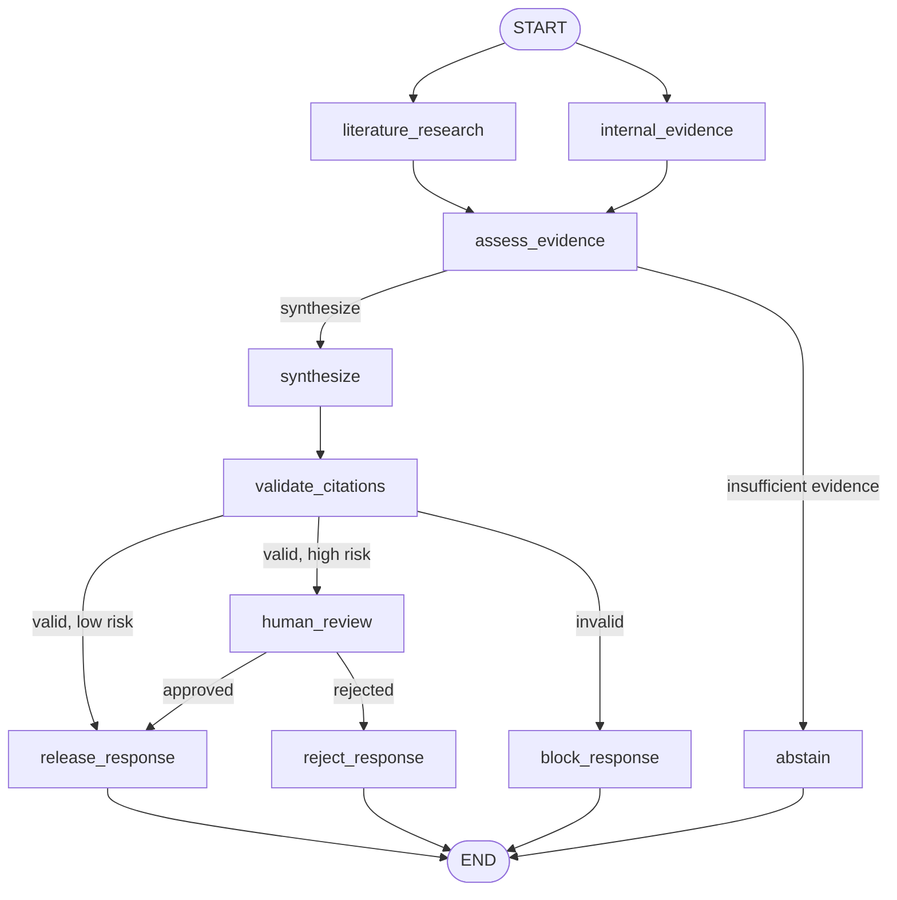

# MedEvidence Research — Implementation Walkthrough

This document describes the current MedEvidence implementation. It is an
operational and architectural guide, not a chronological build transcript.

The use case, medical product, evidence, and identities are synthetic. The
workflow demonstrates engineering controls and must not be used for medical
decision-making.

## 1. Purpose and implemented scope

MedEvidence answers a bounded medical-evidence question by retrieving two
independent evidence sources, assessing evidence completeness, generating a
structured synthesis, validating its citations, and applying deterministic
release policy.

The implementation includes:

- typed LangGraph state and explicit routing;
- parallel literature and internal-evidence branches;
- structured Azure OpenAI synthesis;
- deterministic citation and release controls;
- risk-based human review using LangGraph interrupts;
- SQLite checkpoint persistence for local restart recovery;
- FastAPI endpoints and external response filtering;
- unit, golden-dataset, groundedness, and LangSmith evaluations;
- Docker packaging and GitHub Actions CI.

Core design rule:

> The model creates an internal candidate. It does not validate its own
> citations, decide whether review is required, or authorize release.

## 2. Current architecture



### Parallel retrieval semantics

`START` schedules `literature_research` and `internal_evidence` from the same
pre-branch state. Each branch returns only the state fields it owns. LangGraph
merges those partial updates before `assess_evidence` runs.

This is graph-level fan-out/fan-in. Actual wall-clock overlap depends on the
executor and whether production retrieval adapters perform asynchronous or
otherwise concurrent I/O. The local fixture reads are deliberately small; the
topology, provenance boundary, and failure isolation are the important parts.

## 3. Graph-node map

| Node | Responsibility | Important state effect |
|---|---|---|
| `literature_research` | Retrieve and normalize permitted literature records | Populates `literature_results` |
| `internal_evidence` | Retrieve and normalize approved internal records | Populates `internal_evidence` |
| `assess_evidence` | Apply evidence-completeness and risk policy | Sets `evidence_status` and `response_mode` |
| `synthesize` | Produce a typed internal synthesis | Sets `synthesis_result` and rendered `synthesis` |
| `validate_citations` | Verify citation labels against retrieved evidence | Sets `validation_status` |
| `human_review` | Interrupt and resume high-risk work | Sets approval and reviewer fields |
| `release_response` | Publish an authorized candidate | Sets `final_answer` and released status |
| `abstain` | Stop when evidence is insufficient | Returns a safe abstention |
| `block_response` | Stop when deterministic validation fails | Prevents candidate release |
| `reject_response` | Stop after reviewer rejection | Returns a rejected terminal response |

## 4. State and ownership model

`MedicalResearchState` is the workflow contract. Important fields include:

| State area | Representative fields | Owner |
|---|---|---|
| Request | `user_query`, `risk_level` | API/input boundary |
| Evidence | `literature_results`, `internal_evidence` | Retrieval branches |
| Assessment | `evidence_status`, `response_mode` | Deterministic assessment |
| Candidate | `synthesis_result`, `synthesis` | Synthesis node |
| Validation | `validation_status`, errors | Citation validator |
| Review | approval, reviewer, comment | Human-review node |
| External result | `final_answer`, `release_status` | Release nodes |

Parallel branches return partial updates. Reducers are used only where
concurrent writes must be combined, such as structured workflow errors. State
holds resumable business execution data; detailed traces, latency, and stack
information belong in protected observability systems.

## 5. Component boundaries

| File or directory | Responsibility |
|---|---|
| `use_cases/medevidence_research/graph.py` | Graph topology, routing, compilation, dependency injection |
| `use_cases/medevidence_research/state.py` | Typed workflow state and reducers |
| `use_cases/medevidence_research/nodes.py` | Retrieval and deterministic workflow nodes |
| `use_cases/medevidence_research/tools/retrieval.py` | Synthetic retrieval adapters |
| `use_cases/medevidence_research/llm_synthesis.py` | Structured Azure OpenAI synthesis boundary |
| `use_cases/medevidence_research/citation_validation.py` | Citation-label integrity checks |
| `use_cases/medevidence_research/human_review.py` | Interrupt and resume contract |
| `use_cases/medevidence_research/release.py` | Release, block, abstain, and reject behavior |
| `app/api/main.py` | API contract, response projection, and checkpoint lifecycle |
| `evals/medevidence/` | Datasets, evaluators, calibration, experiments, and baseline |
| `tests/unit/medevidence/` | MedEvidence deterministic unit suite |

The graph accepts an injected synthesis node. Tests use deterministic
synthesis, while the live composition uses Azure OpenAI. Both compositions
must honor the same state contract.

## 6. Retrieval and evidence contract

The two sources remain separate in state to preserve provenance and future
authorization boundaries, but both normalize into a common evidence-record
shape. Synthetic datasets live under:

```text
use_cases/medevidence_research/data/
├── literature.json
└── internal_evidence.json
```

Retrieval is deterministic and bounded for the demo. A production adapter
would replace fixture access with permission-aware literature services,
approved document repositories, or search indexes while preserving the node
and evidence contracts.

## 7. Synthesis and release controls

Azure OpenAI returns a structured synthesis rather than unconstrained final
prose. The workflow renders that structure for display only after validation.

The control sequence is:

1. `synthesize` produces efficacy findings, safety findings, limitations, and
   citation labels.
2. `validate_citations` verifies that every label resolves to evidence supplied
   to the workflow.
3. Invalid citations route to `block_response`.
4. Valid low-risk work routes to `release_response`.
5. Valid high-risk work routes to `human_review`.
6. Reviewer approval releases the candidate; rejection does not.

Citation-label validation establishes referential integrity. Groundedness
evaluation separately assesses whether claims are actually supported by the
cited evidence.

## 8. Checkpointing and human review

Every durable run uses a stable `thread_id`. The live API compiles the graph
with a SQLite checkpointer configured by:

```text
MEDEVIDENCE_CHECKPOINT_DB=.local/medevidence_api.sqlite
```

For a high-risk request, `human_review` calls `interrupt(...)`. LangGraph saves
the execution state and returns a review payload. The review endpoint resumes
the same thread with `Command(resume=...)`; completed upstream work is not
restarted unnecessarily.

SQLite proves restart recovery for a local, single-instance demo. Production
multi-replica execution requires a shared transactional checkpoint store,
atomic ownership or leases, fencing/version checks, and idempotent side
effects.

## 9. API contract

| Method | Endpoint | Purpose |
|---|---|---|
| `GET` | `/health` | Runtime health |
| `POST` | `/v1/medevidence/runs` | Start a workflow |
| `GET` | `/v1/medevidence/runs/{thread_id}` | Read safe workflow status |
| `POST` | `/v1/medevidence/runs/{thread_id}/review` | Approve or reject a paused workflow |

FastAPI response models are the external filtering boundary. An internal
candidate must not be projected into `final_answer` while review is pending.
The API derives `citation_labels` from the structured synthesis object—the same
authoritative structure inspected by citation validation.

The request-supplied reviewer identity is acceptable only for this synthetic
demo. Production must derive the reviewer from authenticated claims and apply
role and separation-of-duties policy.

## 10. Configuration and local setup

```bash
python3.12 -m venv .venv
source .venv/bin/activate
python -m pip install --upgrade pip
python -m pip install -r requirements.txt
```

Required local configuration follows `.env.example`:

```text
AZURE_OPENAI_ENDPOINT=https://<foundry-host>/openai/v1/
AZURE_OPENAI_API_KEY=<local-secret>
AZURE_OPENAI_DEPLOYMENT=<deployment-name>
MEDEVIDENCE_CHECKPOINT_DB=.local/medevidence_api.sqlite

LANGSMITH_TRACING=false
LANGSMITH_API_KEY=
LANGSMITH_PROJECT=medevidence-local
```

Do not commit `.env` or `.local/`.

## 11. Verification

### Deterministic acceptance

```bash
source .venv/bin/activate

LANGSMITH_TRACING=false \
LANGCHAIN_TRACING_V2=false \
python -m compileall -q app use_cases evals scripts

LANGSMITH_TRACING=false \
LANGCHAIN_TRACING_V2=false \
pytest tests/unit/medevidence -q
```

### Start the API

```bash
python -m uvicorn app.api.main:app \
  --host 127.0.0.1 \
  --port 8000 \
  --env-file .env
```

### Low-risk release

```bash
curl --fail-with-body -sS \
  -X POST http://127.0.0.1:8000/v1/medevidence/runs \
  -H 'Content-Type: application/json' \
  -d '{
    "user_query": "What evidence supports Therapy Alpha for reducing chronic pruritus in adults, and what safety limitations remain?",
    "risk_level": "low"
  }' | jq
```

Expected control outcome:

```text
status: completed
release_status: released
response_mode: full
citation_labels: populated
review_request: null
```

### High-risk review and resume

```bash
medevidence_response=$(curl --fail-with-body -sS \
  -X POST http://127.0.0.1:8000/v1/medevidence/runs \
  -H 'Content-Type: application/json' \
  -d '{
    "user_query": "What evidence supports Therapy Alpha for reducing chronic pruritus in adults, and what safety limitations remain?",
    "risk_level": "high"
  }')

echo "$medevidence_response" | jq
medevidence_thread_id=$(echo "$medevidence_response" | jq -r '.thread_id')

curl --fail-with-body -sS \
  -X POST \
  "http://127.0.0.1:8000/v1/medevidence/runs/${medevidence_thread_id}/review" \
  -H 'Content-Type: application/json' \
  -d '{
    "decision": "approve",
    "reviewer_id": "demo-reviewer",
    "comment": "Approved after reviewing the evidence and limitations."
  }' | jq
```

The first response should be `review_required`; the resumed response should be
`completed` and `released` under the same `thread_id`.

## 12. Evaluations

| Layer | Purpose |
|---|---|
| Unit tests | Verify deterministic nodes, schemas, routing, release, API, and resume behavior |
| Golden workflow cases | Verify expected release, response mode, findings, and citation coverage |
| Citation validation | Confirm that labels resolve to supplied evidence |
| Groundedness calibration | Compare judge behavior with human-labeled supported/partial/unsupported cases |
| Workflow groundedness | Evaluate claims from actual workflow outputs |
| LangSmith experiments | Compare complete traced workflow versions |

Run locally:

```bash
python -m evals.medevidence.run_evaluation
python -m evals.medevidence.run_groundedness_calibration
```

Run the managed promotion experiment only with valid LangSmith configuration:

```bash
python -m evals.medevidence.run_langsmith_experiment
```

`evals/medevidence/BASELINE.md` records the accepted comparison point. Live
model evaluations are a release-promotion activity, not a secret-dependent
pull-request CI requirement.

## 13. Packaging and CI

```bash
docker build -t multi-agent-workflow-demo:local .

docker run --rm \
  --name multi-agent-workflow-demo \
  -p 8000:8000 \
  --env-file .env \
  -e MEDEVIDENCE_CHECKPOINT_DB=/app/.local/medevidence_api.sqlite \
  -v medevidence-checkpoints:/app/.local \
  multi-agent-workflow-demo:local
```

The CI workflow performs offline compilation, deterministic unit tests, and a
container build without requiring Azure OpenAI or LangSmith secrets. Live
experiments remain outside ordinary pull-request CI.

## 14. Production translation

| Demo choice | Production translation |
|---|---|
| Synthetic JSON evidence | Permission-aware literature and approved enterprise repositories |
| Request-provided risk | Governed, auditable risk classification |
| SQLite checkpointer | Shared transactional checkpoint store |
| Request-provided reviewer | Authenticated reviewer claims and role policy |
| API-key model access | Managed identity or approved secret management |
| Local container | Managed runtime behind gateway and private networking |
| Local traces | Data-classified, access-controlled observability |
| Demo evaluation set | SME-owned, versioned validation and promotion evidence |

The implementation is production-shaped, not production-ready. Authentication,
enterprise retrieval, shared persistence, multi-replica coordination, formal
audit controls, and GxP validation remain deployment and operating-model work.

## 15. Current decision summary

| Decision | Rationale | Trade-off |
|---|---|---|
| Separate retrieval branches | Preserve provenance and allow independent execution | Requires explicit fan-in and reducers |
| Structured synthesis | Makes validation and API projection machine-readable | Schema and prompt must evolve together |
| Deterministic release policy | Prevents self-approval by the model | Policy changes require code and tests |
| Risk-based HITL | Focuses review on higher-impact work | Requires durable resume and reviewer operations |
| Injected synthesis node | Keeps unit tests fast and offline | Test doubles must preserve live contract parity |
| SQLite for the demo | Proves restart recovery with low setup cost | Not suitable for multiple replicas |
| Live evaluations outside PR CI | Avoids secrets, cost, and model nondeterminism in routine CI | Requires a separate promotion discipline |

## 16. Documentation navigation

- `use_cases/medevidence_research/DEMO.md` — repeatable technical demonstration
- `use_cases/medevidence_research/README.md` — use-case overview
- `use_cases/medevidence_research/RELEASE_CHECKLIST.md` — acceptance record
- `evals/medevidence/README.md` — evaluation dataset contract
- `evals/medevidence/BASELINE.md` — accepted evaluation baseline
- `docs/decisions/BUILD_DECISIONS.md` — cross-use-case decisions

