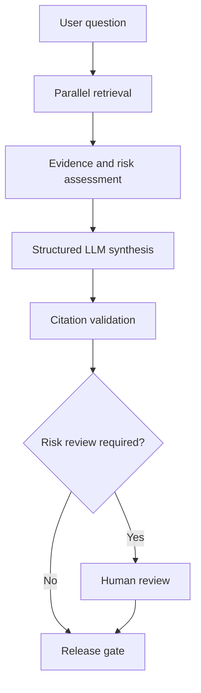

# Enterprise Agentic AI Platform Demo

> Production-minded agentic AI prototype showing reusable orchestration, MCP/tools, structured state, checkpointing, HITL, evaluation, observability, and enterprise deployment patterns.

## Objective

Build one reusable agentic AI framework and prove it across two representative clean-room use cases:

1. **MedEvidence Research**
   - LangGraph multi-agent orchestration
   - parallel research
   - structured state
   - checkpointing / recovery
   - citation validation
   - human approval
   - evaluation / tracing

2. **InsightOps Enterprise Analytics**
   - reusable skills
   - agent + MCP routing
   - governed tool access
   - domain/context routing
   - golden-question evaluation

This repository uses synthetic/public data and does not reproduce confidential client implementations.


## Repository Strategy

Both use cases intentionally live in the **same repository**.

The purpose is to prove that shared platform primitives can support materially different workflows:

```text
Shared Agentic Platform
   ├── MedEvidence Research
   └── InsightOps Enterprise Analytics
```

The use cases remain separated under `use_cases/`, while reusable capabilities live under `app/`.

This lets us demonstrate:

- shared orchestration patterns
- reusable state / checkpointing
- common policy controls
- common observability / evaluation
- reusable MCP / tool abstractions
- independent use-case logic

If either use case later requires its own runtime, scaling profile, security boundary, or release cadence, it can be deployed independently without splitting the source repository immediately.


## Design Principles

- Build concrete first; extract reusable patterns second.
- Keep deterministic things deterministic.
- Use agents where semantic reasoning is needed.
- Compute should be disposable; state should be durable.
- Checkpointing tells us where to resume; idempotency makes recovery safe.
- Prompts guide behavior; deterministic controls enforce policy.
- Reuse capabilities, not whole use cases.
- Evaluation and observability are part of the runtime lifecycle.


## Technology Direction

We will implement incrementally and avoid provisioning infrastructure before it is needed.

Initial stack:

- **LangGraph** — orchestration and stateful workflows
- **LangSmith** — tracing, debugging, evaluation, and regression analysis
- **Azure AI Foundry / Azure OpenAI** — model endpoints
- **Local or lightweight persistence first** — then external durable checkpointing
- **Synthetic/public data only**

Later phases may add:

- **Azure AI Search** for permission-aware / vector retrieval
- **Azure Container Apps** for runtime deployment
- **Managed Identity / Entra ID** for workload and delegated access patterns
- **APIM** for gateway, throttling, policy, and production controls
- **Azure Monitor / Application Insights** if useful alongside LangSmith

Azure AI Search and Foundry do not need to be in the same Azure region for this prototype. Cross-region calls are workable for a demo, although production design should consider latency, data residency, networking, and service availability.


## High-Level Architecture

```text
User / API Client
       |
       v
API / Gateway
       |
       v
LangGraph Orchestrator
       |
 +-----+--------------------------+
 |                                |
 v                                v
Agent / Skill Nodes          Policy Layer
 |                                |
 +---------------+----------------+
                 |
                 v
            Tool / MCP Layer
                 |
        +--------+---------+
        |                  |
        v                  v
Retrieval/Search     Enterprise Data/APIs
        |
        v
Structured Workflow State
        |
        v
Durable Checkpoint Store
        |
        v
Evaluation / Tracing / Monitoring
```

Cross-cutting: Identity, Authorization, State, Security, GxP, Cost, Deployment, Versioning.

## Project Layout

```text
enterprise-agentic-platform-demo/
├── app/
│   ├── api/              # API entry points
│   ├── orchestration/    # LangGraph graphs / routing
│   ├── agents/           # reusable agents / skills
│   ├── tools/            # tool abstractions / adapters
│   ├── mcp/              # MCP client/server/tool schemas
│   ├── state/            # state schemas / reducers / checkpointing
│   ├── policies/         # deterministic policy gates
│   ├── evals/            # reusable evaluators
│   └── observability/    # tracing / metrics / logging
├── use_cases/
│   ├── medevidence_research/
│   └── insightops_analytics/
├── tests/
│   ├── unit/
│   └── integration/
├── evals/
│   ├── datasets/
│   └── results/
├── docs/
│   ├── architecture/
│   └── decisions/
├── scripts/
├── requirements.txt
├── .env.example
└── README.md
```

## MedEvidence-Style Target Architecture



```text
Medical User
    |
    v
Request Validation
    |
    v
LangGraph Orchestrator
    |
    +----------------------+----------------------+
    |                                             |
    v                                             v
Literature Research Agent                Internal Evidence Agent
    |                                             |
    +----------------------+----------------------+
                           |
                           v
                    Synthesis Agent
                           |
                           v
                  Citation Validation
                           |
                           v
                   Human Approval
                           |
                           v
                     Final Response
```

## InsightOps-Style Target Architecture

```text
Business User
    |
    v
Intent / Domain Classifier
    |
    v
Agent / Orchestrator
    |
    v
Skill Selection
    |
    +--------------------+--------------------+
    |                                         |
    v                                         v
Finance Skill                           Operations Skill
    |                                         |
    v                                         v
MCP Finance Tool                        MCP Operations Tool
    |                                         |
    +--------------------+--------------------+
                         |
                         v
                Synthetic Enterprise Data
                         |
                         v
                  Grounded Response
```