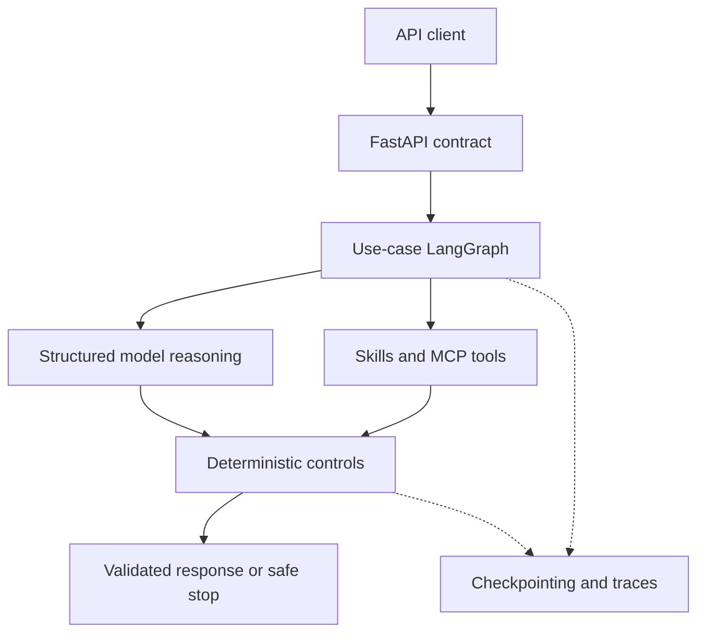
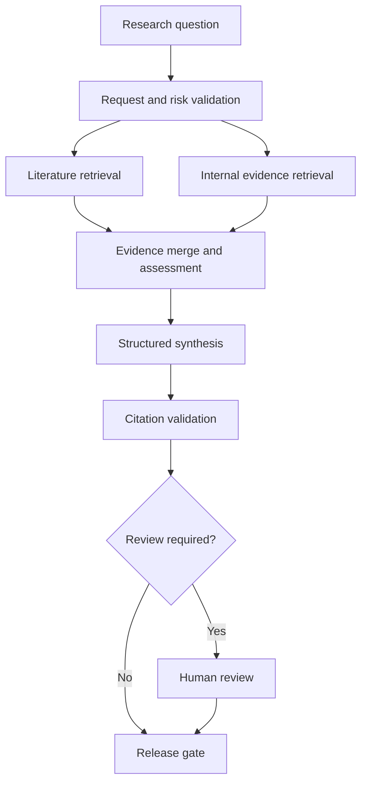
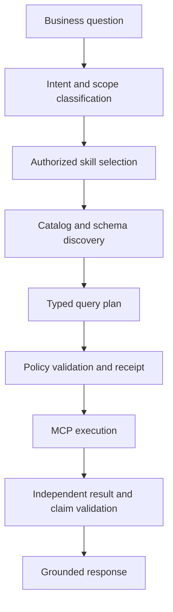

# Enterprise Agentic AI Platform Demo

Production-shaped reference implementation demonstrating how one reusable
agent platform can support workflows with materially different business risks,
autonomy requirements, tools, and release controls.

The repository contains two clean-room use cases:

- **MedEvidence Research** — evidence synthesis with parallel retrieval,
  citation validation, durable checkpoints, risk-based human review, and
  controlled release.
- **EnterpriseOps Analytics** — governed enterprise analytics with progressive
  skill disclosure, MCP tools, user-scoped authorization, typed query plans,
  deterministic numeric validation, and safe failure paths.

All business data, identities, metrics, and scenarios are synthetic. The
repository does not reproduce a confidential client implementation.

## Architectural position

The agent platform is separated from the business automation layer. The
platform provides reusable orchestration, state, skills, tools, observability,
evaluation, API, and deployment patterns. Each use case supplies its own domain
contracts, policies, data adapters, risk controls, and acceptance criteria.

The implementation starts with process value and risk, determines which steps
benefit from agentic reasoning, and keeps authorization, policy, arithmetic,
validation, and release decisions deterministic.

> The model may propose meaning and language. It does not grant itself access,
> approve its own tool use, validate its own numbers, or authorize release.

## Implemented capabilities

| Capability | MedEvidence | EnterpriseOps |
|---|---:|---:|
| Typed LangGraph workflow state | Yes | Yes |
| Structured Azure OpenAI reasoning | Yes | Yes |
| Parallel workflow branches | Yes | Not required |
| Progressive skill disclosure | Not required | Yes |
| MCP-governed tools | Not required | Yes |
| Deterministic authorization and policy | Risk/release policy | Domain/query policy |
| Independent output validation | Citations and release | Results and numeric claims |
| Human-in-the-loop | Risk-based approval | Safe denial/clarification |
| Durable checkpointing | SQLite demo saver | Stateless request demo |
| LangSmith tracing and experiments | Yes | Yes |
| Golden-dataset evaluation | Yes | Yes |
| FastAPI, Docker, and GitHub Actions | Yes | Yes |

## Runtime architecture


```mermaid
flowchart TD
    A["API client"] --> B["FastAPI contract"]
    B --> C["Use-case LangGraph"]
    C --> D["Structured model reasoning"]
    C --> E["Skills and MCP tools"]
    D --> F["Deterministic controls"]
    E --> F
    F --> G["Validated response or safe stop"]
    C -.-> H["Checkpointing and traces"]
    F -.-> H
```

| Boundary | Responsibility |
|---|---|
| FastAPI | Input validation, request IDs, response filtering, review API |
| LangGraph | Explicit state transitions, routing, fan-out/fan-in, resume |
| Azure OpenAI | Structured classification, synthesis, and narration |
| Skills | Versioned domain instructions loaded only after selection |
| MCP | Typed, governed capability and data-access boundary |
| Policy code | Identity, scope, filters, limits, receipts, release decisions |
| Validators | Citation integrity, numeric reconciliation, claim grounding |
| LangSmith | Trace inspection, datasets, experiments, regression evidence |
| Docker/CI | Reproducible runtime artifact and offline quality gates |

## Use case 1: MedEvidence Research

MedEvidence answers a synthetic medical-evidence question while keeping the
LLM inside a governed release process.


```mermaid
flowchart TD
    A["Research question"] --> B["Request and risk validation"]
    B --> C["Literature retrieval"]
    B --> D["Internal evidence retrieval"]
    C --> E["Evidence merge and assessment"]
    D --> E
    E --> F["Structured synthesis"]
    F --> G["Citation validation"]
    G --> H{"Review required?"}
    H -->|No| I["Release gate"]
    H -->|Yes| J["Human review"]
    J --> I
```

The two retrieval nodes form an explicit fan-out/fan-in section of the graph.
Neither retrieval node depends on the other: LangGraph schedules both from the
same upstream state, and reducers merge their evidence into shared state before
assessment and synthesis. This is graph-level concurrency, not a conversation
between two autonomous agents. With local fixtures the latency difference is
negligible; in production the pattern allows independent literature and
internal-system I/O calls to overlap when their adapters are asynchronous or
otherwise executed concurrently.

Key design decisions:

- Literature and approved internal evidence are retrieved through independent
  branches and joined before synthesis.
- Azure OpenAI produces a structured candidate, not an automatically released
  answer.
- Citation labels are validated against supplied evidence.
- High-risk workflows pause through a LangGraph interrupt and resume on the
  same thread after review.
- SQLite preserves local demo checkpoints across process or container restart.
- FastAPI response models prevent internal candidate state from leaking before
  authorization.

## Use case 2: EnterpriseOps Analytics

EnterpriseOps answers synthetic finance and operations questions through
governed semantic definitions and MCP tools.


```mermaid
flowchart TD
    A["Business question"] --> B["Intent and scope classification"]
    B --> C["Authorized skill selection"]
    C --> D["Catalog and schema discovery"]
    D --> E["Typed query plan"]
    E --> F["Policy validation and receipt"]
    F --> G["MCP execution"]
    G --> H["Independent result and claim validation"]
    H --> I["Grounded response"]
```

Key design decisions:

- The registry first exposes small skill metadata; complete `SKILL.md`
  instructions load only after deterministic authorization and selection.
- Skills provide reusable domain knowledge. MCP provides executable
  capabilities. Neither replaces authorization.
- The model produces a typed analytics plan rather than unrestricted SQL.
- Query validation issues an expiring receipt bound to user, plan hash,
  semantic-catalog version, and policy version.
- Execution accepts the validation receipt rather than a newly supplied plan.
- A separate deterministic oracle recalculates expected results.
- Numeric claim validation blocks narration that is not supported by governed
  tool output.
- Unauthorized, unsupported, or underspecified questions stop before data
  execution.

## Repository layout

```text
.
├── app/
│   └── api/
│       ├── main.py
│       └── enterprise_analytics.py
├── use_cases/
│   ├── medevidence_research/
│   └── enterprise_analytics/
│       ├── data/
│       ├── skills/
│       └── mcp_server/
├── evals/
│   ├── medevidence/
│   └── enterprise_analytics/
├── tests/
│   └── unit/
├── scripts/
├── Dockerfile
├── .dockerignore
├── requirements.txt
└── .github/workflows/ci.yml
```

The current implementation keeps use-case orchestration close to each domain
under `use_cases/`. Shared patterns should be extracted into `app/` only when
both use cases demonstrate a stable common contract. This avoids premature
framework abstraction.

## Quick start

### Local environment

```bash
python3.12 -m venv .venv
source .venv/bin/activate
python -m pip install --upgrade pip
python -m pip install -r requirements.txt
```

Create `.env` from `.env.example`, supply the required Azure OpenAI settings,
and add LangSmith settings when tracing or managed experiments are enabled.
Never commit `.env`.

Run deterministic checks without tracing:

```bash
LANGSMITH_TRACING=false \
LANGCHAIN_TRACING_V2=false \
python -m compileall -q app use_cases evals scripts

LANGSMITH_TRACING=false \
LANGCHAIN_TRACING_V2=false \
pytest tests/unit -q
```

### Run with Uvicorn

```bash
python -m uvicorn app.api.main:app \
  --host 127.0.0.1 \
  --port 8000 \
  --env-file .env
```

### Run with Docker

```bash
docker build -t multi-agent-workflow-demo:local .

docker run --rm \
  --name multi-agent-workflow-demo \
  -p 8000:8000 \
  --env-file .env \
  -e MEDEVIDENCE_CHECKPOINT_DB=/app/.local/medevidence_api.sqlite \
  -v medevidence-checkpoints:/app/.local \
  multi-agent-workflow-demo:local
```

Health check:

```bash
curl --fail-with-body -sS -i http://127.0.0.1:8000/health
```

Interactive API documentation:

```text
http://127.0.0.1:8000/docs
```

## API surface

| Method | Endpoint | Purpose |
|---|---|---|
| `GET` | `/health` | Runtime health |
| `POST` | `/v1/medevidence/runs` | Start MedEvidence workflow |
| `GET` | `/v1/medevidence/runs/{thread_id}` | Retrieve workflow state |
| `POST` | `/v1/medevidence/runs/{thread_id}/review` | Approve or reject paused workflow |
| `POST` | `/v1/enterprise-analytics/queries` | Run governed EnterpriseOps query |

### EnterpriseOps example

```bash
curl --fail-with-body -sS \
  -X POST http://127.0.0.1:8000/v1/enterprise-analytics/queries \
  -H 'Content-Type: application/json' \
  -d '{
    "user_query": "Why did Southeast logistics expense exceed budget in August?",
    "user_id": "demo-finance-user"
  }' | jq
```

Expected control fields:

```text
status: completed
question_class: finance_variance
selected_skill: finance_variance
result_valid: true
analytics_result.variance_amount: 150000.00
```

`user_id` is request-supplied only for the synthetic demo. Production must
derive identity and roles from validated authentication claims.

## Evaluation strategy

The project does not rely on a single model-quality score.

| Evaluation layer | Examples |
|---|---|
| Unit contracts | Schemas, reducers, routing, policy, authorization, receipts |
| Domain integrity | Citation labels, semantic definitions, metric formulas |
| Golden behavior | Expected status, skill, tools, results, safe stops |
| Output grounding | Citation support and numeric-claim validation |
| Managed experiments | Live Azure model behavior compared in LangSmith |
| Release gates | Offline CI plus explicit credentialed promotion evaluation |

Ordinary pull-request CI deliberately requires no Azure or LangSmith secrets.
It compiles the source, runs deterministic tests, and builds the container.
Live model experiments remain a controlled promotion activity because they are
slower, costly, and model-dependent.

Accepted EnterpriseOps evidence at the recorded baseline:

```text
EnterpriseOps unit tests:  63 passed
Live evaluation dataset:   6 cases
Container smoke test:      passed
Azure model requests:      HTTP 200
```

## Security and governance boundaries

- Synthetic/public data only
- Non-root container runtime
- Secrets supplied at runtime and excluded from Git
- Deterministic authorization before governed execution
- Typed inputs and outputs with extra fields rejected
- Read-only, allowlisted analytics operations
- Expiring plan-bound validation receipts
- Bounded tool trajectories and safe failure branches
- Human approval for high-risk MedEvidence release
- Trace and evaluation evidence separated from authorization decisions

## Production translation

This repository is **production-shaped, not production-ready**. It demonstrates
the core contracts and controls, while deliberately deferring environment- and
organization-specific infrastructure.

| Demo implementation | Production translation |
|---|---|
| Synthetic retrieval and CSV fixtures | Approved enterprise sources and governed warehouse views |
| Request-body demo identity | Entra ID/OIDC authentication and claims-derived subject |
| Static entitlements | Central policy service plus source-system authorization |
| Local MCP | Authenticated remote MCP behind gateway and network controls |
| SQLite checkpoints | PostgreSQL or managed durable checkpoint store |
| Process-local receipts | Signed, expiring, durable validation receipts |
| Local skill files | Approved, versioned skill registry with provenance |
| One container | Independently scalable services where boundaries require |
| Runtime `.env` | Managed identity and Key Vault |
| Local API | APIM, private networking, throttling, WAF, audit integration |
| Demo controls | Formal intended-use, validation, change control, and GxP evidence where applicable |

## Implementation and demo guides

- [MedEvidence implementation walkthrough](IMPLEMENTATION_WALKTHROUGH.md)
- [EnterpriseOps implementation walkthrough](ENTERPRISEOPS_IMPLEMENTATION_WALKTHROUGH.md)
- [EnterpriseOps interview demo runbook](ENTERPRISEOPS_DEMO_RUNBOOK.md)

## Final design principles

- Start with process value and workflow risk.
- Use model reasoning only where semantic interpretation adds value.
- Keep authorization, policy, arithmetic, and release deterministic.
- Treat state, identity, and tool authority as explicit contracts.
- Load skills progressively and expose tools through governed interfaces.
- Make safe failure behavior part of the functional design.
- Evaluate trajectories and release decisions—not only final prose.
- Keep compute disposable and business state durable.
- Reuse platform capabilities without coupling domain implementations.
