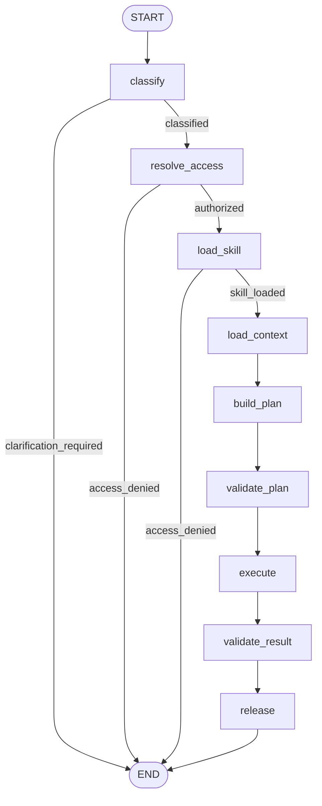

# EnterpriseOps Analytics — Technical Demo Guide

This guide provides a repeatable demonstration of the EnterpriseOps governed
analytics workflow for technical users. It covers progressive skill disclosure,
MCP tools, authorization, typed planning, policy validation, independent numeric
validation, evaluation, and production translation.

All users, metrics, business units, and financial data are synthetic.

## What the use case demonstrates

EnterpriseOps answers questions such as:

- Why did Southeast logistics expense exceed budget in August?
- Which business units contributed most to the unfavorable variance?
- Did shipment volume or cost per shipment drive the variance?

The workflow demonstrates:

- structured Azure OpenAI intent classification and query planning;
- metadata-first skill discovery and progressive disclosure;
- deterministic skill eligibility and domain authorization;
- governed semantic definitions and dataset schemas;
- typed MCP tools rather than unrestricted data access;
- expiring validation receipts bound to user, plan, catalog, and policy;
- deterministic reference calculation and numeric claim validation;
- clarification and access-denied paths that stop before execution;
- golden datasets, LangSmith experiments, FastAPI, Docker, and CI.

## Background and design rationale

Natural-language analytics combines semantic interpretation with high-consequence
deterministic work. A model can identify business intent and explain a result,
but should not invent metric definitions, authorize data access, execute an
unbounded query, or validate its own arithmetic.

The implementation separates responsibilities:

| Responsibility | Owner |
|---|---|
| Classify intent and propose a typed plan | Structured LLM reasoning |
| Determine eligible domains and skills | Deterministic authorization |
| Supply business definitions | Versioned semantic catalog |
| Validate query shape and scope | Deterministic query policy |
| Execute approved analytics | MCP query service |
| Recalculate expected results | Independent deterministic oracle |
| Explain validated results | Structured LLM narration |
| Approve external response | Claim and release validation |

Core principle:

> The model proposes semantic intent and language; deterministic controls own
> authority, execution, arithmetic, and release.

## Skills and progressive disclosure

Skills are not an imported software library. A skill is a versioned package of
domain instructions and metadata.

Progressive disclosure works as follows:

1. The registry exposes small metadata records for available skills.
2. Deterministic authorization removes ineligible skills.
3. Routing selects from the eligible candidates.
4. Only the selected skill's full `SKILL.md` instructions are loaded.
5. The selected skill and version become traceable workflow state.

This reduces prompt size, prevents unauthorized domain instructions from being
loaded, and keeps domain specialization independently maintainable.

Skills provide knowledge and instructions. MCP provides governed executable
capabilities. Neither replaces identity or policy enforcement.

## Architecture



These labels are the logical nodes registered by the live EnterpriseOps
LangGraph. The conditional edges after `classify`, `resolve_access`, and
`load_skill` are deliberate early exits. An unsupported question ends with a
clarification, while an unauthorized identity ends before complete skill
instructions, query validation, or data execution are exposed.

The successful route is intentionally linear after authorization. It loads
only the selected skill, discovers governed context, creates a typed plan,
validates that plan, executes it through MCP, independently validates the
result, and finally produces a grounded response. `release` may still return a
clarification instead of an answer when result validation fails or the
narrative contains unsupported numeric claims.

### Graph-node map

| Graph node | Implementation responsibility | Primary state effect or boundary |
|---|---|---|
| `classify` | Classify supported intent and extract period, region, and category scope | Sets question class and normalized scope, or returns `clarification_required` |
| `resolve_access` | Call `list_available_domains` and check the user's eligible domains before instructions or data access | Sets authorized status or terminates with `access_denied` |
| `load_skill` | Select from authorized skill metadata and load only the chosen `SKILL.md` | Sets selected skill, version, and instructions |
| `load_context` | Retrieve the dataset schema and governed metric definitions through MCP | Populates the semantic context used for planning |
| `build_plan` | Use structured model reasoning to create a typed query plan bound to classified scope | Sets `query_plan`; it does not execute data access |
| `validate_plan` | Call `validate_query` to apply deterministic policy and obtain a user- and plan-bound receipt | Sets the validation identifier/receipt required for execution |
| `execute` | Call `execute_analytics_query` with the receipt rather than accepting a new plan | Sets `analytics_result` and records the governed tool trajectory |
| `validate_result` | Call `validate_result` to compare observed output with the independent deterministic contract | Sets `result_valid` and validation errors |
| `release` | Generate the narrative, validate its numeric claims, and choose completion or clarification | Sets `final_answer` only when result and claim validation pass |

The permitted trajectory is therefore bounded by the graph rather than left to
open-ended model tool selection. The topology is defined in
`use_cases/enterprise_analytics/live_graph.py`. The deterministic test graph in
`graph.py` exercises the same governance pattern without requiring live Azure
OpenAI calls.

## Prerequisites

- Python 3.12
- Project virtual environment and installed `requirements.txt`
- Azure OpenAI configuration in `.env`
- LangSmith configuration when tracing or managed evaluations are enabled
- `jq` for formatted output
- Docker for packaged-runtime execution

Never display or commit `.env`.

## Pre-demo validation

```bash
source .venv/bin/activate

LANGSMITH_TRACING=false \
LANGCHAIN_TRACING_V2=false \
pytest tests/unit/enterprise_analytics -q
```

## Start the application

### Preferred: Docker

```bash
docker build -t multi-agent-workflow-demo:local .

docker run --rm \
  --name multi-agent-workflow-demo \
  -p 8000:8000 \
  --env-file .env \
  -e MEDEVIDENCE_CHECKPOINT_DB=/app/.local/medevidence_api.sqlite \
  -v medevidence-checkpoints:/app/.local \
  multi-agent-workflow-demo:local
```

### Fallback: Uvicorn

```bash
source .venv/bin/activate

python -m uvicorn app.api.main:app \
  --host 127.0.0.1 \
  --port 8000 \
  --env-file .env
```

## Verify runtime health

```bash
curl --fail-with-body -sS -i \
  http://127.0.0.1:8000/health
```

Expected:

```text
HTTP/1.1 200 OK
```

Interactive API documentation:

```text
http://127.0.0.1:8000/docs
```

## Scenario 1 — Governed finance variance

```bash
curl --fail-with-body -sS \
  -X POST http://127.0.0.1:8000/v1/enterprise-analytics/queries \
  -H 'Content-Type: application/json' \
  -d '{
    "user_query": "Why did Southeast logistics expense exceed budget in August?",
    "user_id": "demo-finance-user"
  }' | jq
```

Verify:

```text
status: completed
question_class: finance_variance
selected_skill: finance_variance
result_valid: true
analytics_result.variance_amount: 150000.00
```

The expected trajectory ends with:

```text
validate_query
execute_analytics_query
validate_result
```

Technical points to highlight:

- Metric formulas come from the governed semantic catalog.
- The LLM creates a typed plan, not raw unrestricted SQL.
- The plan is checked before execution.
- Execution uses an expiring validation receipt bound to the approved plan.
- Business-unit contributions reconcile to the total variance.
- Numeric narrative claims are checked against governed result fields.

## Scenario 2 — Least-privilege denial

The finance-only user is not entitled to the Operations domain:

```bash
curl --fail-with-body -sS \
  -X POST http://127.0.0.1:8000/v1/enterprise-analytics/queries \
  -H 'Content-Type: application/json' \
  -d '{
    "user_query": "Did shipment volume or cost per shipment drive the Southeast variance in August?",
    "user_id": "demo-finance-user"
  }' | jq
```

Verify:

```text
status: access_denied
final_answer: null
```

Confirm that `validate_query`, `execute_analytics_query`, and `validate_result`
do not appear in the trajectory. Access denial occurs before data execution.

## Scenario 3 — Authorized operations analysis

The synthetic analyst identity has both Finance and Operations access:

```bash
curl --fail-with-body -sS \
  -X POST http://127.0.0.1:8000/v1/enterprise-analytics/queries \
  -H 'Content-Type: application/json' \
  -d '{
    "user_query": "Did shipment volume or cost per shipment drive the Southeast variance in August?",
    "user_id": "demo-analyst"
  }' | jq
```

Verify:

```text
status: completed
question_class: operations_driver
selected_skill: operations_performance
result_valid: true
analytics_result.primary_driver: cost_per_shipment
analytics_result.rate_effect: 135000.00
```

## Scenario 4 — Clarification instead of guessing

```bash
curl --fail-with-body -sS \
  -X POST http://127.0.0.1:8000/v1/enterprise-analytics/queries \
  -H 'Content-Type: application/json' \
  -d '{
    "user_query": "Why did Southeast logistics expense exceed budget?",
    "user_id": "demo-finance-user"
  }' | jq
```

Verify:

```text
status: clarification_required
```

The workflow requests a reporting period instead of inventing one, and no
query-execution tools should appear in the trajectory.

## Evaluation demonstration

### Offline golden evaluation

```bash
LANGSMITH_TRACING=false \
LANGCHAIN_TRACING_V2=false \
python -m evals.enterprise_analytics.run_offline
```

### Managed LangSmith experiment

```bash
python -m evals.enterprise_analytics.run_langsmith_experiment
```

Confirm each managed case meets the configured gates, including:

```text
governed_contract = 1.0
safe_release = 1
```

Evaluation coverage includes:

| Behavior | Evidence |
|---|---|
| Intent and skill routing | Expected question class and selected skill |
| Authorization | Denied identities stop before validation/execution |
| Tool governance | Required and forbidden tool trajectories |
| Query policy | Filters, dimensions, metrics, limits, and plan binding |
| Numeric correctness | Deterministic golden result comparison |
| Narrative grounding | Numeric claim validation |
| Safe failure | Clarification and access-denied behavior |

## Focused code tour

| File | Purpose |
|---|---|
| `live_graph.py` | Live LLM graph and deterministic control nodes |
| `state.py` | Typed shared workflow state |
| `skill_registry.py` | Metadata discovery, authorization filtering, instruction loading |
| `skills/*/SKILL.md` | Domain-specific reasoning instructions |
| `mcp_server/server.py` | Typed MCP tool surface |
| `mcp_server/query_service.py` | Authorization, policy, receipts, execution |
| `query_policy.py` | Allowlisted deterministic plan policy |
| `reference_calculator.py` | Independent finance and operations calculations |
| `golden_result_validation.py` | Runtime result validation contract |
| `claim_validation.py` | Numeric narrative validation |
| `app/api/enterprise_analytics.py` | External API and response filtering |
| `evals/enterprise_analytics/` | Versioned dataset and evaluators |

## Common troubleshooting

| Symptom | Likely cause | Action |
|---|---|---|
| `ModuleNotFoundError: use_cases` with `mcp dev` | CLI import root differs from project execution | Run from repository root with project on `PYTHONPATH`; standalone inspector is optional |
| Azure returns 404 | Foundry v1 base URL or deployment configuration is incorrect | Compare `.env` with `.env.example`; do not print the key |
| `validate_result` reports missing JSON | Runtime contract was not packaged | Confirm it exists under `use_cases/enterprise_analytics/data/` inside the image |
| Operations plan contains `cost_category` | Model added a finance-only filter | Canonically bind plan to classified scope before MCP execution |
| Unit tests are slow | Tracing is enabled | Disable both LangSmith and LangChain tracing variables |

## Identity boundary

The request-body `user_id` exists only for the synthetic demonstration. In
production:

- authenticate through Entra ID/OIDC;
- derive subject, tenant, groups, and roles from validated claims;
- apply policy before exposing skill instructions or data tools;
- propagate delegated identity or approved workload identity;
- re-enforce object and row permissions in the data platform;
- avoid placing sensitive identity or question text in traces without policy.

## Production translation

This implementation is production-shaped, not production-ready.

| Demo implementation | Production translation |
|---|---|
| Synthetic CSV data | Snowflake or governed warehouse views |
| Local semantic JSON | Enterprise catalog and governed semantic layer |
| Request-body identity | Entra ID/OIDC claims-derived identity |
| Static entitlements | Central policy service and source-system RBAC |
| Local MCP server | Authenticated remote MCP behind gateway controls |
| In-memory receipts | Signed, expiring, durable receipts and audit trail |
| Local skills | Approved, versioned skill registry with provenance |
| Single container | Independently scalable services when boundaries require |
| Runtime `.env` | Managed identity and Key Vault |
| Demo evaluations | Versioned promotion gates tied to release artifacts |

The reusable asset is not a universal autonomous agent. It is the governed
platform pattern: typed orchestration, bounded skills and tools, external
identity, deterministic policy, independent validation, observable execution,
and evaluation-driven promotion.
