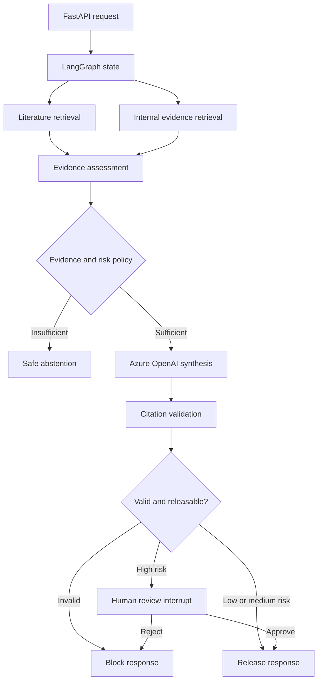

# MedEvidence — Governed Agentic Medical-Evidence Workflow

MedEvidence is a production-shaped LangGraph demonstration that retrieves
synthetic literature and internal evidence in parallel, uses Azure OpenAI for
structured synthesis, validates citations deterministically, and releases,
blocks, abstains, or pauses for human review according to explicit policy.

> **Scope:** All evidence is synthetic. This application is an engineering and
> demonstration, not a clinical decision-support system.

## What This Demonstrates

- Explicit, typed workflow state and node-scoped updates
- Parallel literature and internal-evidence retrieval
- Deterministic evidence, access, risk, citation, and release policies
- Azure OpenAI structured-output synthesis
- High-risk human-in-the-loop review using LangGraph `interrupt()`
- Checkpointing, pause/resume, and restart recovery
- LangSmith tracing and experiment visibility
- Golden-dataset and calibrated groundedness evaluations
- FastAPI boundary with a reduced external response contract
- SQLite local durability, Docker packaging, and GitHub Actions CI

## Architecture



The important boundary is that the LLM creates an internal candidate; it does
not decide whether that candidate can leave the workflow.

## Deterministic Code Versus Model Reasoning

| Capability | Implementation | Why |
| --- | --- | --- |
| Retrieval and source filtering | Deterministic Python | Predictable ranking and access enforcement |
| Evidence completeness | Deterministic policy | Safety behavior must be reproducible |
| Risk routing | Deterministic policy | The LLM cannot waive controls |
| Evidence synthesis | Azure OpenAI | Requires semantic combination and qualification |
| Citation-label validation | Deterministic Python | Unknown references must fail closed |
| Release, block, or abstain | Deterministic policy | Candidate generation is separate from authorization to release |
| High-risk approval | Human decision through `interrupt()` | Creates an accountable review boundary |
| Groundedness assessment | Calibrated offline LLM judge | Useful evaluation signal, but not treated as ground truth |

## Codebase Walkthrough

Start with these files when explaining the implementation:

| Path | What to explain |
| --- | --- |
| `use_cases/medevidence_research/graph.py` | Nodes, fan-out/fan-in, conditional routing, checkpointer injection |
| `use_cases/medevidence_research/state.py` | Typed workflow contract, node ownership, reducers for legitimate parallel writes |
| `use_cases/medevidence_research/nodes.py` | Retrieval adapters, evidence assessment, deterministic abstention |
| `use_cases/medevidence_research/schemas.py` | Structured synthesis contract and validation constraints |
| `use_cases/medevidence_research/llm_synthesis.py` | Evidence payload, allowed labels, Azure OpenAI call, rendered candidate |
| `use_cases/medevidence_research/citation_validation.py` | Referential-integrity check for model-produced citations |
| `use_cases/medevidence_research/human_review.py` | Dynamic high-risk interrupt and structured resume decision |
| `use_cases/medevidence_research/release.py` | Final release/block boundary and external answer creation |
| `app/api/main.py` | API contracts, thread IDs, graph invocation/resume, response minimization |
| `evals/medevidence/` | Golden cases, rubric, calibrated judge, experiment runner, accepted baseline |
| `tests/unit/` | Deterministic component, graph, HITL, API, persistence, and evaluation-contract tests |
| `Dockerfile` and `.github/workflows/ci.yml` | Reproducible runtime and automated regression gate |

Show `graph.py` first, then one
representative deterministic control, the LLM boundary, and the evaluation
folder.

## Setup and Verification

```bash
python3.12 -m venv .venv
source .venv/bin/activate
python -m pip install --upgrade pip
python -m pip install -r requirements.txt
```

Create `.env` from `.env.example` and provide the Azure OpenAI and LangSmith
settings. Never commit `.env`.

```bash
python -c "import sys; print(sys.executable)"
git ls-files .env
python -m compileall -q app use_cases evals scripts
pytest tests/unit -v
docker build -t medevidence-api:local .
```

The interpreter should point to `.venv/bin/python`, `git ls-files .env` should
produce no output, and the current accepted snapshot has 36 deterministic unit
tests. The suite requires no live Azure OpenAI or LangSmith call.

## Prepare Before the Demo

Terminal A:

If the container already exists, delete it and create a new one.
```bash
docker rm -f medevidence-api
```

```bash
docker run --rm \
  --name medevidence-api \
  -p 8000:8000 \
  --env-file .env \
  -e MEDEVIDENCE_CHECKPOINT_DB=/app/.local/medevidence_api.sqlite \
  -v medevidence-checkpoints:/app/.local \
  medevidence-api:local
```

Use terminal B for the following commands.

### 3. Code Structure

Open `graph.py` and explain the topology, conditional edges, injected synthesis
node, and injected checkpointer. Then briefly show:

- `state.py`: typed state and reducer behavior;
- `llm_synthesis.py`: the live model boundary;
- `citation_validation.py` and `release.py`: candidate-to-answer gate; and
- `human_review.py`: `interrupt()` and `Command(resume=...)`.

> I did not make every step an LLM agent. Retrieval controls, routing, citation validation, and release are deterministic. I used model reasoning only where semantic synthesis adds value.

### 4. Run a Low-Risk Request

```bash
curl --fail-with-body -sS -i http://127.0.0.1:8000/health

curl --fail-with-body -sS \
  -X POST http://127.0.0.1:8000/v1/medevidence/runs \
  -H 'Content-Type: application/json' \
  -d '{
    "user_query": "What evidence supports Therapy Alpha for reducing chronic pruritus in adults, and what safety limitations remain?",
    "risk_level": "low"
  }' | jq
```

Point out that `status=completed`, `release_status=released`, the final answer
and citation labels are populated, and raw internal evidence and errors are not
exposed. If `jq` is unavailable, use `python -m json.tool`.

### 5. Demonstrate High-Risk HITL

```bash
medevidence_review_response=$(curl --fail-with-body -sS \
  -X POST http://127.0.0.1:8000/v1/medevidence/runs \
  -H 'Content-Type: application/json' \
  -d '{
    "user_query": "What evidence supports Therapy Alpha for reducing chronic pruritus in adults, and what safety limitations remain?",
    "risk_level": "high"
  }')

echo "$medevidence_review_response" | jq
medevidence_thread_id=$(echo "$medevidence_review_response" | jq -r '.thread_id')

curl --fail-with-body -sS \
  -X POST "http://127.0.0.1:8000/v1/medevidence/runs/${medevidence_thread_id}/review" \
  -H 'Content-Type: application/json' \
  -d '{
    "decision": "approve",
    "reviewer_id": "demo-reviewer",
    "comment": "Approved during the technical demonstration."
  }' | jq
```

The first call returns `review_required` without an external final answer. The
second supplies a structured human decision. `Command(resume=...)` reloads the
checkpoint and continues from the pending review instead of replaying completed
retrieval and synthesis.

### 6. Show Tracing and Evaluations

Open the matching LangSmith trace and show parallel branches, node latency,
model input/output, citation validation, interrupt/resume, and release status.

Then open `evals/medevidence/BASELINE.md` and explain:

| Evaluation layer | What it proves |
| --- | --- |
| Unit/component tests | Deterministic contracts, routing, schemas, reducers, and API behavior |
| Golden workflow cases | Expected release, abstention, citation, and evidence behavior |
| Groundedness calibration | Judge agreement with labeled supported/partial/unsupported cases |
| Managed LangSmith experiment | Repeatable execution and comparison across versions |
| Promotion gates | Hard failures versus metrics requiring review before release |

For a quick live proof, run only:

```bash
pytest \
  tests/unit/test_eval_dataset.py \
  tests/unit/test_groundedness_calibration.py \
  -q
```

Below is the recorded baseline and trace. The release-time commands are:

```bash
python -m evals.medevidence.run_golden_dataset
python -m evals.medevidence.run_groundedness_calibration
python -m evals.medevidence.run_langsmith_experiment
```

### 7. Close With Production Translation — 30 Seconds

> This is production-shaped rather than production-ready. The orchestration, safety gates, human review, persistence contract, observability, evaluations, API, container, and CI are demonstrated. For production I would replace synthetic retrieval with governed search, SQLite with shared PostgreSQL, add thread-level authorization and workload identity, coordinate replicas with leases and fencing, place the API behind APIM, use private networking and Key Vault, and execute formal validation based on the GxP intended use.

## Demo Timing Card

| Time | Show | Confidence signal |
| --- | --- | --- |
| 0:00–0:30 | Problem | Clear business and safety objective |
| 0:30–1:30 | Architecture | Deliberate deterministic/LLM separation |
| 1:30–2:30 | Codebase | State, topology, policy, dependency injection |
| 2:30–3:30 | Low-risk request | Synthesis, validation, and release |
| 3:30–5:00 | High-risk request | Interrupt, checkpoint, decision, resume |
| 5:00–6:15 | LangSmith and evals | Traceability and measurable quality |
| 6:15–7:00 | Production translation | Honest gaps and credible hardening plan |
