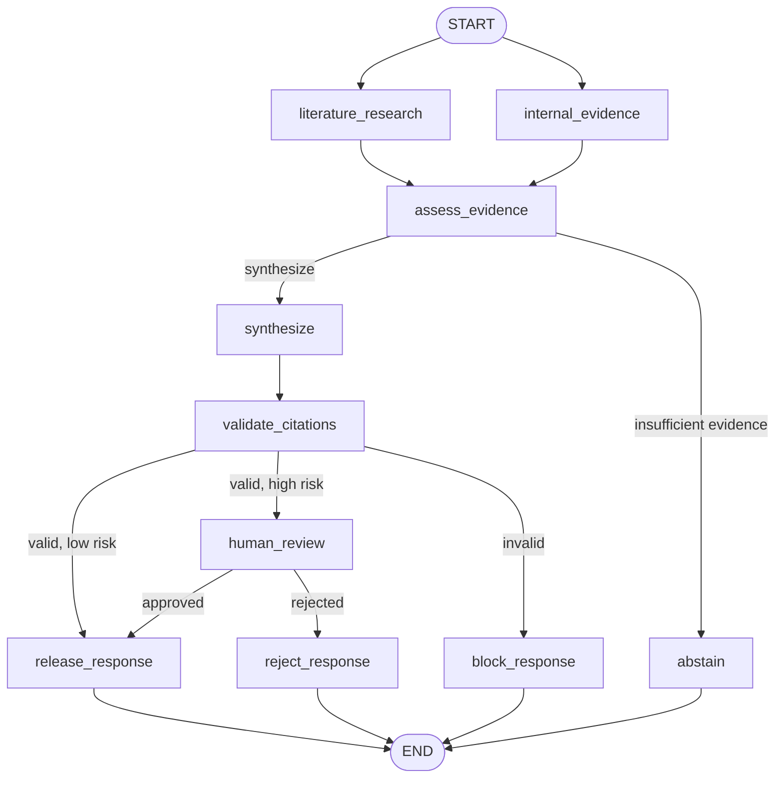

# MedEvidence Research — Technical Demo Guide

This guide provides a repeatable demonstration of the MedEvidence Research
workflow for technical users. It covers the architecture, design rationale,
runtime setup, automated release, human review, persistence, evaluation, and
production translation.

The use case and all evidence are synthetic. The workflow is intended to
demonstrate engineering patterns, not provide medical advice.

## What the use case demonstrates

MedEvidence answers a question about synthetic clinical evidence while keeping
the language model inside an explicit control framework:

- parallel retrieval from literature and approved internal evidence;
- typed LangGraph state and deterministic routing;
- structured Azure OpenAI synthesis;
- citation validation against supplied evidence;
- risk-based release or human review;
- durable pause, restart, and resume;
- external response filtering through FastAPI;
- unit, golden-dataset, groundedness, and LangSmith evaluations;
- containerized execution and CI.

## Background and design rationale

Evidence synthesis contains both semantic and deterministic work. A model is
useful for interpreting evidence and producing a coherent synthesis, but it
should not decide whether its own citations are valid or whether a high-risk
response can be released.

The implementation therefore separates responsibilities:

| Responsibility | Owner |
|---|---|
| Interpret retrieved evidence | Structured LLM synthesis |
| Assess workflow risk | Deterministic policy |
| Verify citation labels | Deterministic validator |
| Decide whether review is required | Deterministic routing |
| Approve high-risk release | Human reviewer |
| Persist pause/resume state | LangGraph checkpointer |
| Filter external fields | FastAPI response model |

Core principle:

> The LLM produces an internal candidate. It does not authorize its own
> release.

## Architecture



These labels are the logical nodes registered by the MedEvidence LangGraph.
`START` schedules `literature_research` and `internal_evidence` from the same
pre-branch state. Each node returns only the fields it owns, and LangGraph
merges those partial updates before running the shared `assess_evidence` node.
The list of both upstream retrieval nodes creates the fan-in barrier: assessment
cannot begin until both scheduled branches have completed.

This is what **parallel evidence retrieval** means in this implementation. It
is graph-level fan-out/fan-in, not two autonomous agents conversing. The graph
makes both branches independently schedulable; actual wall-clock overlap
depends on whether the retrieval adapters and executor perform the I/O
concurrently. Local fixture reads are so small that latency is not the point.
The topology is valuable because production literature and internal-system
adapters can perform independent remote I/O without forcing one source to wait
for the other.

After retrieval, deterministic nodes retain control. `assess_evidence` chooses
synthesis or abstention. `validate_citations` chooses release, review, or
blocking. `human_review` uses a LangGraph interrupt, so approval or rejection
resumes the same checkpointed thread rather than starting the workflow again.

### Graph-node map

| Graph node | Implementation responsibility | Primary state effect |
|---|---|---|
| `literature_research` | Retrieve and normalize permitted literature records | Populates `literature_results` |
| `internal_evidence` | Retrieve and normalize permitted internal records | Populates `internal_evidence` |
| `assess_evidence` | Evaluate evidence completeness and risk policy | Sets `evidence_status` and `response_mode` |
| `synthesize` | Create a typed evidence synthesis | Sets `synthesis_result` and rendered `synthesis` |
| `validate_citations` | Check citation labels against the retrieved evidence | Sets `validation_status` |
| `human_review` | Pause high-risk work and consume the resume decision | Sets approval and reviewer fields |
| `release_response` | Project an authorized candidate into the external result | Sets `final_answer` and released status |
| `abstain` | End when evidence is insufficient for supported synthesis | Returns a safe abstention |
| `block_response` | Prevent release when deterministic validation fails | Returns a blocked safe response |
| `reject_response` | Prevent release after reviewer rejection | Returns a rejected safe response |

The graph topology is defined in `use_cases/medevidence_research/graph.py`.
Node implementations are split across `nodes.py`, `llm_synthesis.py`,
`citation_validation.py`, `human_review.py`, and `release.py` so each boundary
can be tested independently.

## Prerequisites

- Python 3.12
- Project virtual environment and installed `requirements.txt`
- Azure OpenAI configuration in `.env`
- LangSmith configuration when tracing or managed evaluations are enabled
- `jq` for formatted command output
- Docker for the packaged-runtime demonstration

Never display or commit `.env`.

## Pre-demo validation

```bash
source .venv/bin/activate

LANGSMITH_TRACING=false \
LANGCHAIN_TRACING_V2=false \
pytest tests/unit/medevidence -q
```

Confirm `.env` and local checkpoints are not tracked:

```bash
git ls-files .env
git ls-files '.local/*'
```

Both commands must return no files.

## Start the application

### Preferred: Docker

```bash
docker build -t multi-agent-workflow-demo:local .

docker run --rm \
  --name multi-agent-workflow-demo \
  -p 8000:8000 \
  --env-file .env \
  -e MEDEVIDENCE_CHECKPOINT_DB=/app/.local/medevidence_api.sqlite \
  -v medevidence-checkpoints:/app/.local \
  multi-agent-workflow-demo:local
```

### Fallback: Uvicorn

```bash
source .venv/bin/activate

python -m uvicorn app.api.main:app \
  --host 127.0.0.1 \
  --port 8000 \
  --env-file .env
```

The Uvicorn fallback bypasses container packaging only. It runs the same API,
graph, model, validation, checkpoint, and review code.

## Verify runtime health

From a second terminal:

```bash
curl --fail-with-body -sS -i \
  http://127.0.0.1:8000/health
```

Expected:

```text
HTTP/1.1 200 OK
```

Interactive API documentation is available at:

```text
http://127.0.0.1:8000/docs
```

## Scenario 1 — Low-risk automatic release

```bash
curl --fail-with-body -sS \
  -X POST http://127.0.0.1:8000/v1/medevidence/runs \
  -H 'Content-Type: application/json' \
  -d '{
    "user_query": "What evidence supports Therapy Alpha for reducing chronic pruritus in adults, and what safety limitations remain?",
    "risk_level": "low"
  }' | jq
```

Verify:

```text
status: completed
release_status: released
response_mode: full
final_answer: populated
citation_labels: populated
review_request: null
```

Technical points to highlight:

- `START` fans out to `literature_research` and `internal_evidence`; the graph
  joins them at `assess_evidence` before synthesis.
- The model returns a typed synthesis object.
- The displayed answer is rendered from structured output.
- Citation validation checks the same structured citation labels exposed by
  the API.
- Deterministic release policy runs after synthesis and validation.

## Scenario 2 — High-risk human review

Start a high-risk workflow:

```bash
medevidence_review_response=$(curl --fail-with-body -sS \
  -X POST http://127.0.0.1:8000/v1/medevidence/runs \
  -H 'Content-Type: application/json' \
  -d '{
    "user_query": "What evidence supports Therapy Alpha for reducing chronic pruritus in adults, and what safety limitations remain?",
    "risk_level": "high"
  }')

echo "$medevidence_review_response" | jq
```

Capture the thread:

```bash
medevidence_thread_id=$(
  echo "$medevidence_review_response" |
  jq -r '.thread_id'
)

echo "$medevidence_thread_id"
```

Verify the paused response:

```text
status: review_required
final_answer: null
review_request: populated
```

Inspect the checkpointed run:

```bash
curl --fail-with-body -sS \
  "http://127.0.0.1:8000/v1/medevidence/runs/${medevidence_thread_id}" |
  jq
```

Approve and resume:

```bash
curl --fail-with-body -sS \
  -X POST \
  "http://127.0.0.1:8000/v1/medevidence/runs/${medevidence_thread_id}/review" \
  -H 'Content-Type: application/json' \
  -d '{
    "decision": "approve",
    "reviewer_id": "demo-reviewer",
    "comment": "Approved after reviewing the evidence and limitations."
  }' | jq
```

Verify:

```text
status: completed
release_status: released
final_answer: populated
```

The same `thread_id` resumes from the interrupt. Retrieval and synthesis should
not be repeated unnecessarily.

## Optional durability demonstration

This demonstration proves that a paused workflow survives replacement of the
container process. It assumes the image has already been built and the API is
running with this checkpoint configuration:

```text
MEDEVIDENCE_CHECKPOINT_DB=/app/.local/medevidence_api.sqlite
named volume: medevidence-checkpoints
mount path: /app/.local
```

Run the following commands from a second terminal. Keep this shell open because
it holds the captured `thread_id`.

### 1. Start a high-risk run and retain its thread ID

```bash
medevidence_durable_response=$(curl --fail-with-body -sS \
  -X POST http://127.0.0.1:8000/v1/medevidence/runs \
  -H 'Content-Type: application/json' \
  -d '{
    "user_query": "What evidence supports Therapy Alpha for reducing chronic pruritus in adults, and what safety limitations remain?",
    "risk_level": "high"
  }')

echo "$medevidence_durable_response" | jq

medevidence_durable_thread_id=$(
  echo "$medevidence_durable_response" |
  jq -er '.thread_id'
)

echo "Paused thread: ${medevidence_durable_thread_id}"
```

Verify before stopping the container:

```bash
echo "$medevidence_durable_response" |
  jq -e '
    .status == "review_required" and
    .final_answer == null and
    .review_request != null
  '
```

`jq` should print `true` and exit successfully.

### 2. Stop the original container

```bash
docker stop multi-agent-workflow-demo
```

The container was started with `--rm`, so Docker removes that container after
it stops. The named volume remains. Confirm it still exists:

```bash
docker volume inspect medevidence-checkpoints \
  --format '{{.Name}}'
```

Expected:

```text
medevidence-checkpoints
```

### 3. Start a replacement container using the same volume

Start the replacement in detached mode so the remaining checks can run in this
terminal:

```bash
docker run -d --rm \
  --name multi-agent-workflow-demo \
  -p 8000:8000 \
  --env-file .env \
  -e MEDEVIDENCE_CHECKPOINT_DB=/app/.local/medevidence_api.sqlite \
  -v medevidence-checkpoints:/app/.local \
  multi-agent-workflow-demo:local
```

Wait for the replacement API and confirm health:

```bash
for attempt in $(seq 1 30); do
  if curl --fail-with-body -sS \
    http://127.0.0.1:8000/health >/dev/null; then
    break
  fi
  sleep 1
done

curl --fail-with-body -sS \
  http://127.0.0.1:8000/health |
  jq
```

If the replacement does not become healthy, inspect:

```bash
docker logs multi-agent-workflow-demo
```

### 4. Retrieve the original paused run

Use the `thread_id` captured before the container was replaced:

```bash
medevidence_recovered_response=$(curl --fail-with-body -sS \
  "http://127.0.0.1:8000/v1/medevidence/runs/${medevidence_durable_thread_id}")

echo "$medevidence_recovered_response" | jq
```

Verify that the replacement process recovered the pending checkpoint:

```bash
echo "$medevidence_recovered_response" |
  jq --arg thread_id "$medevidence_durable_thread_id" -e '
    .thread_id == $thread_id and
    .status == "review_required" and
    .final_answer == null and
    .review_request != null
  '
```

### 5. Approve and resume the recovered thread

```bash
medevidence_resumed_response=$(curl --fail-with-body -sS \
  -X POST \
  "http://127.0.0.1:8000/v1/medevidence/runs/${medevidence_durable_thread_id}/review" \
  -H 'Content-Type: application/json' \
  -d '{
    "decision": "approve",
    "reviewer_id": "durability-demo-reviewer",
    "comment": "Approved after recovering the paused workflow from the persistent checkpoint."
  }')

echo "$medevidence_resumed_response" | jq
```

Verify successful release under the original thread:

```bash
echo "$medevidence_resumed_response" |
  jq --arg thread_id "$medevidence_durable_thread_id" -e '
    .thread_id == $thread_id and
    .status == "completed" and
    .release_status == "released" and
    (.final_answer | (type == "string" and length > 0))
  '
```

Expected result:

```text
true
```

Stop the replacement when the demonstration is complete:

```bash
docker stop multi-agent-workflow-demo
```

This proves that workflow state is external to the disposable container
process and persisted in the named volume. It also proves that the same
checkpointed `thread_id` can resume after process replacement without repeating
the completed workflow from the beginning.

SQLite is appropriate for this single-instance local demonstration. A shared
transactional checkpoint store, concurrency controls, and idempotent side
effects are required for multi-replica production execution.

## Evaluation demonstration

### Offline evaluation

```bash
LANGSMITH_TRACING=false \
LANGCHAIN_TRACING_V2=false \
python -m evals.medevidence.run_evaluation
```

### Groundedness calibration

```bash
LANGSMITH_TRACING=false \
LANGCHAIN_TRACING_V2=false \
python -m evals.medevidence.run_groundedness_calibration
```

### Managed LangSmith experiment

```bash
python -m evals.medevidence.run_langsmith_experiment
```

Use `evals/medevidence/BASELINE.md` as the accepted comparison point. Managed
experiments should be a controlled promotion activity rather than a required
pull-request CI step.

The evaluation layers answer different questions:

| Layer | Question answered |
|---|---|
| Unit tests | Are deterministic components and routes correct? |
| Golden cases | Does the complete workflow produce expected control outcomes? |
| Citation checks | Are references resolvable to supplied evidence? |
| Groundedness calibration | Are material claims supported by evidence? |
| LangSmith experiment | Did a model, prompt, or workflow change regress behavior? |

## Focused code tour

| File | Purpose |
|---|---|
| `graph.py` | Workflow topology, fan-out/fan-in, routing, injection |
| `state.py` | Typed state and reducers |
| `nodes.py` | Retrieval and workflow nodes |
| `llm_synthesis.py` | Structured Azure OpenAI boundary |
| `citation_validation.py` | Referential-integrity control |
| `human_review.py` | Interrupt and resume behavior |
| `release.py` | Deterministic external release gate |
| `app/api/main.py` | API, response projection, persistence lifecycle |
| `evals/medevidence/` | Datasets, evaluators, calibration, baseline |

## Common troubleshooting

| Symptom | Likely cause | Action |
|---|---|---|
| Curl prints nothing | `-s` hid connection failure | Use `--fail-with-body -sS -i` and check `/health` |
| Azure returns 404 | Incorrect Foundry base URL or deployment configuration | Compare `.env` with `.env.example`; never print the key |
| Citation labels are empty | API projected a legacy state field | Project labels from structured `synthesis_result` |
| Review cannot resume after restart | Checkpoint path is process-local or volume absent | Use configured SQLite path and persistent volume |
| Unit tests are unexpectedly slow | Live tracing callbacks are enabled | Set both tracing variables to `false` |

## Production translation

This implementation is production-shaped, not production-ready.

| Demo implementation | Production translation |
|---|---|
| Synthetic evidence | Approved literature, document, and data integrations |
| Request-body risk | Policy-derived risk classification and authenticated context |
| Request-body reviewer ID | Reviewer identity from Entra ID/OIDC claims |
| SQLite checkpoints | PostgreSQL or managed durable checkpoint store |
| One process | Queue-backed workers with leases, fencing, and idempotency |
| Runtime `.env` | Managed identity and Key Vault |
| Local API | APIM, private networking, throttling, audit controls |
| Demo evaluation | Versioned SME-approved validation and change control |

For regulated intended uses, add formal validation, auditability, segregation of
duties, approved data lineage, record retention, and GxP change controls.
