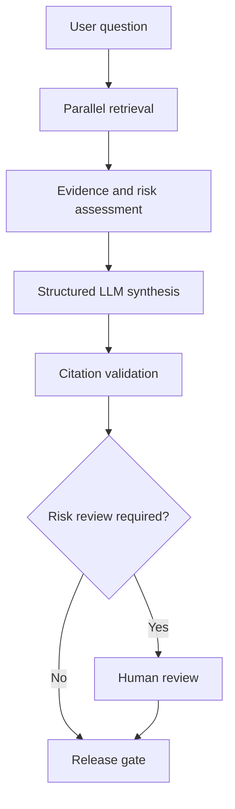

# MedEvidence Agentic Workflow Demo

MedEvidence is a clean-room LangGraph reference implementation that uses only
synthetic evidence. It demonstrates parallel evidence retrieval, structured
Azure OpenAI synthesis, deterministic citation validation, risk-based human
review, checkpoint/resume, LangSmith tracing, and calibrated groundedness
evaluation.

This repository is an educational portfolio prototype. It is not a clinical
decision-support system and must not be used for patient care.

## Architecture



## Core Design Principles

- Use deterministic automation for retrieval filters, routing, citation-label
  integrity, and release policy.
- Use the LLM only for semantic synthesis and calibrated evaluation.
- Keep literature and internal evidence in separate state branches.
- Treat `synthesis` as an internal candidate and `final_answer` as the only
  externally releasable response.
- Persist workflow state by `thread_id` and require explicit review for
  configured risk levels.

## Prerequisites

- Python 3.12
- An Azure OpenAI-compatible GPT deployment
- Optional LangSmith account for tracing and managed experiments

## Setup

```bash
python3.12 -m venv .venv
source .venv/bin/activate
python -m pip install --upgrade pip
python -m pip install -r requirements.txt
cp .env.example .env
```

Populate the Azure values in `.env`. Enable LangSmith variables only when
tracing or managed experiments are required.

## Verify Model Connectivity

```bash
python -m scripts.smoke_test
```

## Run Unit Tests

```bash
pytest tests/unit -v
```

Unit tests use deterministic synthesis or injected fakes and should not require
Azure calls unless a test is explicitly marked as an integration test.

## Run the Workflow

```bash
python -m scripts.run_medevidence
```

## Demonstrate Durable Pause and Resume

```bash
python -m scripts.run_medevidence_durable pause \
  --thread-id durable-demo-001

python -m scripts.run_medevidence_durable resume \
  --thread-id durable-demo-001
```

SQLite demonstrates cross-process durability on one machine. Production
multi-replica execution requires a shared durable checkpointer and execution
coordination such as PostgreSQL plus leases, versioning, and idempotency.

## Run Evaluations

```bash
python -m evals.medevidence.run_golden_dataset
python -m evals.medevidence.run_groundedness_calibration
python -m evals.medevidence.run_langsmith_experiment
```

See `evals/medevidence/BASELINE.md` for the accepted baseline, component
versions, metrics, promotion gates, and known limitations.

## Project Structure

```text
app/                       Shared configuration and model clients
data/                      Synthetic evidence corpora
evals/medevidence/         Datasets, evaluators, and baseline
scripts/                   Runnable demonstrations
tests/unit/                Deterministic regression tests
use_cases/medevidence_research/
                           Graph, state, nodes, policies, and synthesis
```

## Safety and Scope

- All included medical content is synthetic.
- Restricted or superseded evidence is filtered before synthesis.
- Citation integrity does not independently prove clinical correctness.
- The calibrated groundedness judge remains an offline evaluation signal.
- Production use requires governed identity, authorization, retrieval,
  telemetry, validation, security, privacy, and GxP controls.

## Documentation

- `IMPLEMENTATION_WALKTHROUGH.md` — implementation decisions and tradeoffs
- `evals/medevidence/README.md` — evaluation dataset contract
- `evals/medevidence/BASELINE.md` — accepted evaluation baseline